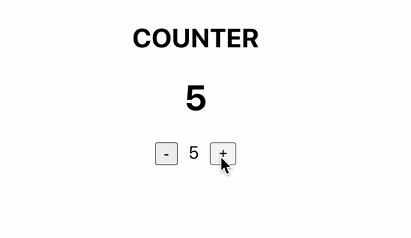

## Latihan React JS Bagian 2 - Redux Intro
Project ini merupakan bagian dari seri tutorial react JS yang disediakan oleh microdata.

### Sebelum Memulai
Pastikan git sudah terinstall di komputer anda, 
jika belum, panduannya bisa dilihat [disini](https://git-scm.com/book/en/v2/Getting-Started-Installing-Git).<br />

### Pemasangan
Clone repository.<br />
Jalankan perintah dibawah ini untuk mengambil repositori
```
git clone https://github.com/cooljar/reactReduxIntro.git
```

Masuk ke direktori project dengan menjalankan perintah berikut
```
cd reactReduxIntro
```

Memasang semua paket dependency dengan menjalankan perintah berikut
```
npm install
```

### Menjalankan Aplikasi
Jalankan perintah berikut untuk mulai menjalankan aplikasi
```
npm start
```
Buka browser dan ketikan alamat: http://localhost:3000

### Contoh Tampilan


### Apa Yang Harus Diselesaikan Pada Latihan Ini
Aplikasi ini dibuat hanya menggunakan state. Tugas yang harus diselesaikan adalah ubah aplikasi ini menggunakan state management react-redux.

- [React Redux](https://react-redux.js.org/introduction/quick-start)
- [Contoh aplikasi yang mengimplementasikan react-redux](https://github.com/dceddia/redux-intro)


